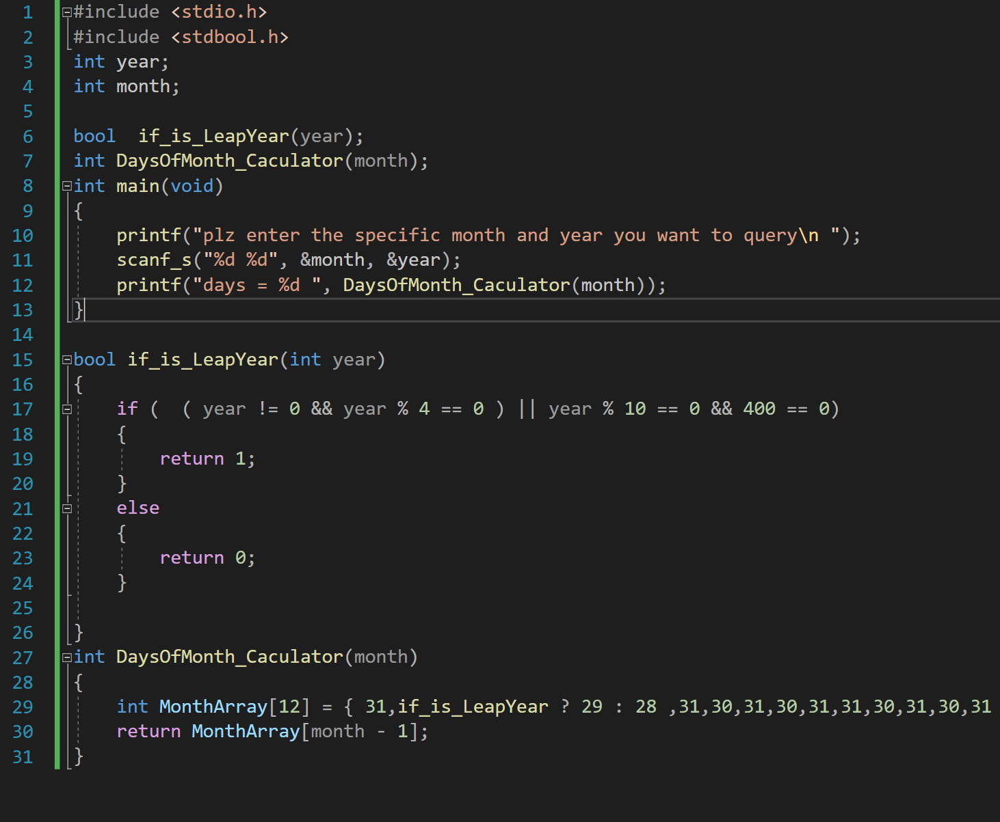

重点 : 表驱动法

当需要使用过多if else 发生冗余时 ， 尝试使用 数据库 或 数组来代替

例如 ： 判断月份天数

#include \<stdio.h>

#include \<stdbool.h>

int year;

int month;

bool if_is_LeapYear(year);

int DaysOfMonth_Caculator(month);

int main(void)

{

printf("plz enter the specific month and year you want to query\\n ");

scanf_s("%d %d", &month, &year);

printf("days = %d ", DaysOfMonth_Caculator(month));

}

bool if_is_LeapYear(int year)

{

if ( ( year != 0 && year % 4 == 0 ) \|\| year % 10 == 0 && 400 == 0)

{

return 1;

}

else

{

return 0;

}

}

int DaysOfMonth_Caculator(month)

{

int MonthArray\[12\] = { 31,if_is_LeapYear ? 29 : 28 ,31,30,31,30,31,31,30,31,30,31 };

return MonthArray\[month - 1\];

}
2022年7月26日
14:28

运算符
一元运算符 ： 针对一个数操作，如a ++
二元运算符 ： 针对两个数 ，如 a+ b
三元运算符 : if else 的平替
语法： exp 1 ? exp 2 : exp 3
?表达式的值由 exp1 决定
if ？表达式的值为1 ， 计算exp2
为0 ， 计算 exp 3
