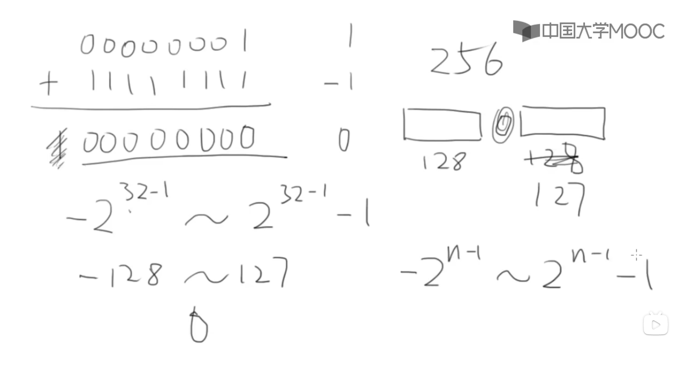

2022年7月28日
6:32
char 类型 1个字节的内存 有八位

11111111 \~ 10000000 -1 \~ -128

00000001 \~ 01111111 1 \~ 127

正负的内部表达？
负数一般用补码表示
-1 的补码 是 11111111, 故与1相加溢出，为0

0开头的是八进制 %o
0x开头的是十六进制 %x
%加小数点再加数字限制小数点后位宽，会四舍五入。
%.3f 0.0049 会输出为0.005

小数默认是double类型
如果要表示float类型要在后面加f
如1.32323f
强制类型转换：
（变量类型）数
如： (short)32768

printf 会自动类型转换
scanf 不会自动类型转换
