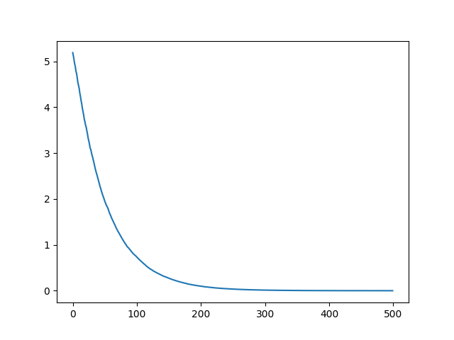

# Linear Regression with Gradient Descent

## 基本原理

$y = WX^T + b$

$W = [w_1,w_2,w_3...w_n]$

$X = [x_1,x_2,x_3,...x_n]$

其中
$n$
为特征数

---

损失函数: $J=\frac{1}{2m}\Sigma_{i=1}^m(\hat y-y_i)^2$

其中
$\hat{y}=WX^T+b$

$m$
为样本数量

---

迭代过程:

$w_i=w_i-\frac{LR}{m}\Sigma\frac{\partial J}{\partial w_i}$

$b=b-\frac{LR}{m}\Sigma\frac{\partial J}{\partial b}$

其中
$LR$
为学习率

### 该损失函数图像呈现为凹面，具有全局最小值

### 求偏导得损失函数在某点梯度，令参数沿梯度反方向减少，若干次迭代后求得损失函数最小值

### LR值应足够小，确保迭代后最终能取得全局最小值 , 且应足够大，使训练速度足够快

---

## 代码实现

目标拟合函数 $y = 2x + 3$

```python
import numpy as np
import pandas as pd
import random
import matplotlib.pyplot as plt

#设置随机数种子，样本数，特征数
np.random.seed(2023)
samples = 100
features = 1

#设置初始参数为标准正态分布随机数
w = np.random.normal(0,1,(1,features)) 
b = np.random.normal(0,1,1) 

#设置训练集
w_true = np.array([[2]])
b_true = np.array([3])

x = np.random.normal(0,1,(samples,features))
y_true = w_true.dot(x.T) + b_true
y_pre = w.dot(x.T) + b

#开始迭代
iterate_times = 500
cnt = 1
m = 4
lr = 0.01

cost = []
while cnt<= iterate_times:
    idx = random.sample(range(samples) , m)
    w = w - lr/m*(y_pre - y_true)[:,idx].dot(x[idx,:]) 
    b = b - lr/m*(y_pre - y_true)[:,idx].sum()
    y_pre = w.dot(x.T) + b

    cost.append(np.mean(y_pre - y_true)**2/2)
    cnt+=1

#绘制迭代过程图像
pd.Series(cost).plot()
plt.show()
```

