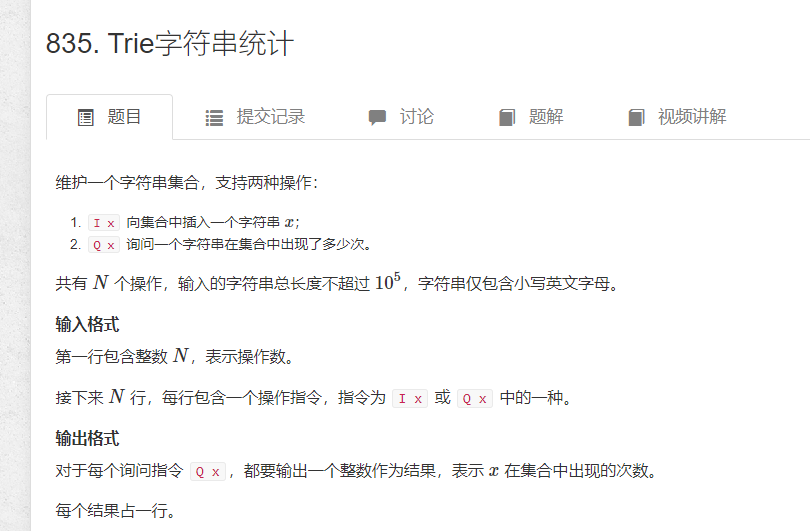

# trie树 方便快速查找储存字符串

[原题](https://www.acwing.com/problem/content/837/)
  

```cpp
const int N = 1e6;
/*son为trie树，26是因为存的是字母，每个节点最多只有26个子节点
cnt计数当前节点一共有几个字母
idx和单链表一样，用来表示当前用到的节点下标
下标存的是映射过后的字母值，数组元素存的是树节点的下一个节点位置
*/
int son[N][26], cnt[N] , idx=0;
char str[N];
void insert(char* s) {
	//下标是0的节点，是根节点，也是空节点
	//p为每一次存储走到的最深的那个点
	int p = 0;
	for (int i = 0; s[i]; i++) {
		//把字母映射成数字
		int u = s[i] - 'a';
		//如果当前节点不存在，那么创建
		if (!son[p][u])son[p][u] = ++idx;
		p = son[p][u];
	}
	cnt[p]++;
}
int query(char* s) {
	int p = 0;
	for (int i = 0; s[i]; i++) {
		int u = s[i] - 'a';
		if (!son[p][u])return 0;
		p = son[p][u];
	}
	return cnt[p];
}
```

## 可持久化trie

1. 一个root数组存各个版本根节点地址，根节点为空
2. 每插入一个新字串作为新的版本
3. 新版本copy上一版本的指针，同时新字串开辟新的空间,只更改变动部分

```cpp
const int N = 2e5+10 , M = N*25 ;
int num[N] , root [N] , tr[M][2] , idx;
//以 01 trie 为例
 // i 为 版本号 ，k为二进制位数 ，p为上一个版本 ，q为新版本
void insert(int i , int k , int p , int q){ 
	//从高位到低位插入
	if(k < 0 ) return;
	int digi = num[i] >> k & 1;
	if(p) tr[q][digi^1] = tr[p][digi^1]; // copy 操作
	tr[q][v] = ++idx; // 开点
	insert( i , k - 1 , tr[p][v] , tr[q][v]);

}

```
