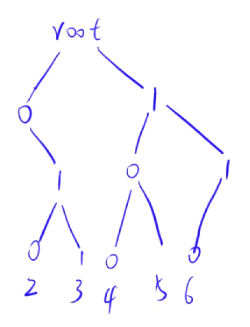

# 最大异或对.md
[原题](https://www.acwing.com/problem/content/description/145/)

---
**思路** : 先对这组数组进行预处理，建立一个trie树，同层节点对应一位，树从高位向低位展开，如果这个数组中有某个数存在，使这一位为0或1，那么就存入这个节点。
例如:
  
之后便贪心地做就可以了,拿到一个数，对它由高位向低位分解，拿分解出来的每一位在树向深处搜索。

```cpp
#include <bits/stdc++.h>
using namespace std;
const int N = 100010, M = 3000010;
int son[M][2];//子节点最多2
int a[N];
int idx = 0;
void insert(int x) {
	int p = 0;
    //-1补码都是1，取反变0
    //最大31位，只需要右移30位最多
	for (int i = 30; ~i; i--) {
		int& s = son[p][x >> i & 1];
		if (!s) s = ++idx;
		p = s;
	}
}
int query(int x) {
	int res=0, p = 0;
	for (int i = 30; ~i; i--) {
		int s = x >> i & 1;
		if (son[p][!s]) {
			res += 1 << i;
			p = son[p][!s];
		}
		else {
			res += 0 << i;
			p = son[p][s];
		
		}
	}
	return res;
}
signed main() {
	int n;
	cin >> n;
	for (int i = 0; i < n; i++) {
		cin >> a[i];
		insert(a[i]);
	}
	int res = 0;
	for (int i = 0; i < n; i++) {
		res = max(res,query(a[i])); 
	}
	cout << res;

}
```
