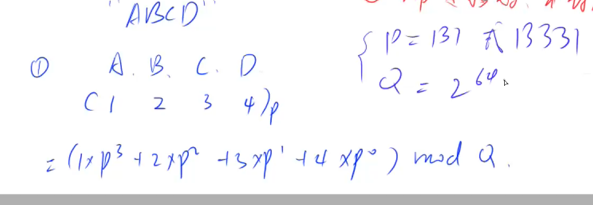
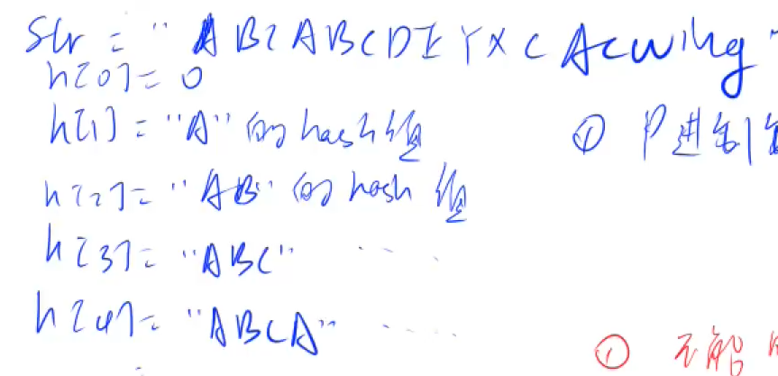

# 字符串哈希表   有可能会发生冲突，但冲突可能比较小
  

>对字符串哈希的时候，把字符串当成一个p进制的数字，A~Z依次是1~26，**不能取0**。
>之后算出该数字的数值，此时不会哈希冲突，但是这个数值过大，要mod上一个比较小的数字，之后会冲突
#### 一般来说p取131，mod数取 $2^{64}$
---
>预处理的时候要对一个字符串的前缀都取上哈希值
  

#####当我们对所有的前缀都取到哈希值的时候，所有的子串的哈希值就都能通过此计算

$str[L,R]=str_1[1,R]-str_2[1,L-1]*p^{r-l+1}$
#### 证明:
- $str_2$ 最高次幂$l-2$
- $str_1$ 最高次幂$r-1$
- 故$str_2*p^{r-l+1}$便和$str_1$位次左对齐
- 而我们想要的子串是$p^{r-(l-1)}$为最高次幂
- 根据模运算定律，(a-b)%c = (a%c - b%c)%c
- 而我们使用$2^{64}$来mod，那么只需要用usigned long long 存储，超过自动溢出便相当于取mod
- 则$str_1$与$str_2$做差就得到我们想要的子串哈希值

```cpp
#include <iostream>
#include <cstring>
typedef unsigned long long ULL;
using namespace std;
const int N = 100010,P=131;
char str[N];
ULL h[N],p[N];
ULL get(int l, int r) {
	return h[r] - h[l - 1] * p[r - l + 1];
}
signed main() {
	int n, m;
	cin >> n >> m>>str+1;
	p[0] = 1;
	for (int i = 1; i <= n; i++) {
		p[i] = p[i - 1] * P;
		h[i] = h[i - 1] * P + str[i];
	}
	while (m--) {
		int l1, r1, l2, r2;
		cin >> l1 >> r1 >> l2 >> r2;
		if (get(l1, r1) == get(l2, r2))cout << "Yes\n";
		else cout << "No\n";
	}
	return 0;
}
```
