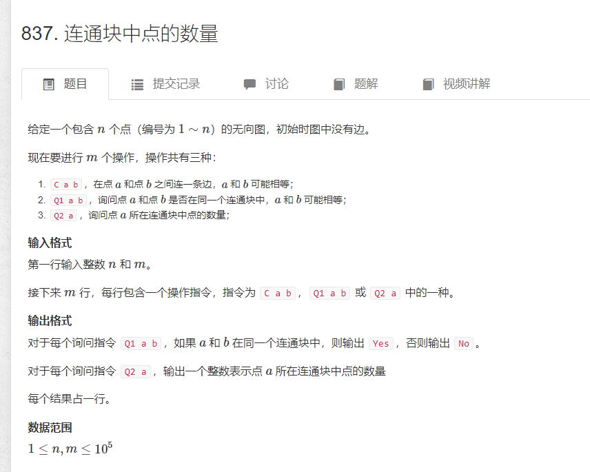

# 并查集
- 将两个集合合并
- 询问两个元素是否在一个集合当中
---
# 实现
### 用树的形式来维护所有的集合
- 根节点的编号是集合的编号
- 对于每个子节点存储它的父节点
- 若是根节点，`p[x] == x`
- 求x的集合 ：` while(p[x] != x)x=p[x] `
- 合并集合 : 将某一个根节点变成另一个根节点的子节点 `p[x] = y`

### 优化 路径压缩
  

当我对某个元素向上搜索它的根节点，沿途把所有它的父节点存储全都改成根节点
---
[原题](https://www.acwing.com/problem/content/838/)
  

```cpp
#include <bits/stdc++.h>
#define int long long
using namespace std;
const int N = 100010;
int n, m;
int p[N];
//返回x所在的集合,查找过程不断优化
int find(int x) {
	if (p[x] != x)p[x] = find(p[x]);
	return p[x];
}

signed main() {
	cin >> n >> m;
	//根节点初始化
	for (int i = 1; i <= n; i++)p[i] = i;
	while (m--) {
		string query;
		int a, b;
		cin >> query >> a >> b;
		if (query == "M")p[find(a)] = find(b);
		else {
			if (find(a) == find(b))cout << "Yes\n";
			else cout << "No\n";
		}
	}
}
```


---
### 另一道题
[原题](https://www.acwing.com/problem/content/839/)
  

设置size数组，记录父节点包含的数量
```cpp
#include <bits/stdc++.h>
#define int long long
using namespace std;
const int N = 100010;
int p[N]; int _size[N];
int connect(int x) {
	if (x != p[x])p[x] = connect(p[x]);
	return p[x];
}
signed main() {
	int n, m;
	cin >> n >> m;
    //初始状态每个根节点包含一个元素
	for (int i = 1; i <= n; i++)p[i] = i,_size[i] =1;
	while (m--) {
		string query;
		int a, b;
		cin >> query;
		if (query == "C") {
			cin >> a >> b;
            //每次做连接，相当于把集合A包含的数量加个集合B,再把两个集合拼到一起
			if (connect(a) == connect(b))continue;
			_size[connect(b)] += _size[connect(a)];
			p[connect(a)] = connect(b);
		}
		else if (query == "Q1") {
			cin >> a >> b;
			if (connect(a) == connect(b))cout << "Yes\n";
			else cout << "No\n";
		}
		else {
			cin >> a;
			cout << _size[connect(a)]<<'\n';
		}
	}
}
```