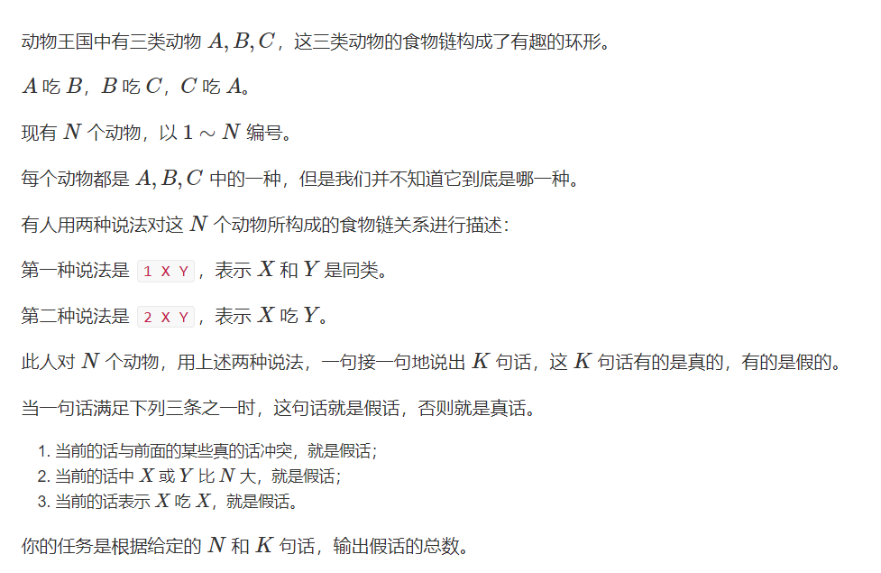

# 食物链  
## 利用并查集存储并维护集合中元素的关系
[原题](https://www.acwing.com/problem/content/242/)
  
---
**思路**

1. 存储
   - 捏一棵树，每次说的如果是真话，就把元素之间的关系存到我的树中
   - 每次询问，我都访问下我的树，如果没有冲突，才能合并
---
2. 怎么用并查集来表示元素之间的关系
   - 三种动物是三次一循环，而父节点和子节点必然是吃与被吃的关系，那么对当前节点和根节点的距离模运算就可判断当前节点跟根节点的关系
           
        - 当子节点和根节点的距离模三的时候 **:**
        - 余1 可以吃根节点
        - 余2 被根节点吃
        - 余三 跟根节点是同类
---
3. 如何存储该节点到根节点的距离
     - 开一个数组distance，用来存储距离，数组下标表节点。
     - 在并查集find函数压缩路径的时候，可以顺便递归地存储距离 
     - find函数递归到第i层的时候，第i层到根节点距离就是它本身到父节点的距离加上父节点到根节点的距离，而后者已经求出来了。

---
4. 若两个元素的根节点不同
     - 表明我们不能由当前的所有真话推断出该询问为假，那么根据题目条件，该询问为真，应该合并到集合
     - 那么我们假定将根节点a合并到根节点b，合并之后a节点到b节点的距离还需要我们人为的附加一个特定的数值，使这个询问为真
---
```cpp
#include <bits/stdc++.h>
using namespace std;
#define int long long
const int N = 50020;
int p[N];
int d[N];
int find(int x) {
	
	if (x != p[x]) {
		int temp = find(p[x]);
		d[x] += d[p[x]];
		p[x] = temp;
	}
	return p[x];
}
signed main() {
	int n, k;
	cin >> n >> k;
	//距离数组初始值为0，此时每个节点都是根节点，和自己的距离为0
	for (int i = 1; i <= n; i++)p[i] = i;
	int ans = 0;
	while (k--) {
		int query;
		int X, Y;
		cin >> query >> X >> Y;
		if (X > n || Y > n)ans++;
		else {
			int px = find(X);
			int py = find(Y);
			if (query == 1) {
				if (px == py && (d[X] - d[Y])%3)ans++;
				else if (px != py) {
					p[px] = py;
					d[px] = d[Y] - d[X];
				}
			}
			else {
				if (px == py && (d[X] - d[Y] - 1)%3)ans++;
				else if(px != py) {
					p[px] = py;
					d[px] = d[Y] + 1 - d[X];
				}
			}
		}
	}
	cout << ans;
}
```
   