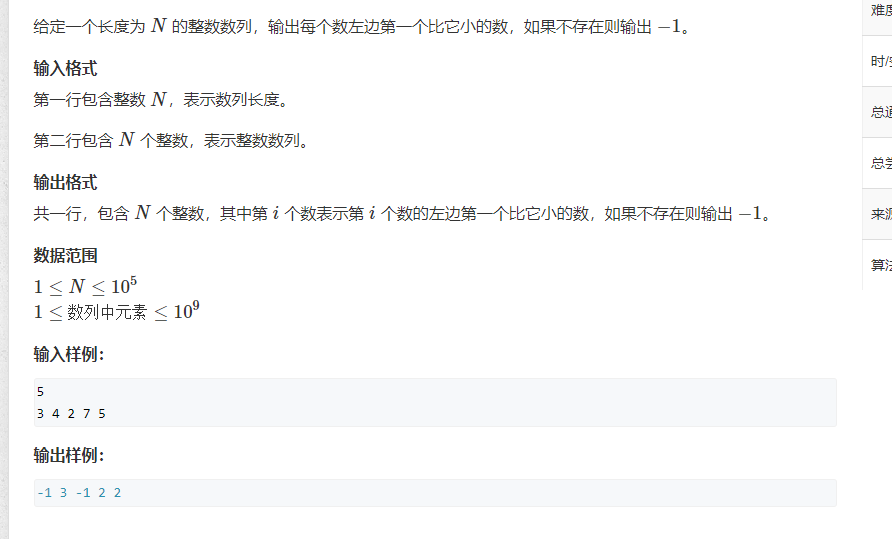

# 单调栈
>[原题](https://www.acwing.com/problem/content/832/)
  

**性质** 
>栈中每次存储的都是从1~i-1个元素，若存在一个数，它的数值比前一面某一个数小，那么前面的那个数值是无效数值，将其pop掉,保证整个栈是单调的。

>而在对第i个数求答案的时候,也在不断的使这个栈单调化，即从栈顶向栈底遍历，i <= stk[j]的时候，std[j]无疑是无效数据，pop掉
```cpp
#include<bits/stdc++.h>
using namespace std;
#define int long long
const int N = 1e5 + 10;
int stk[N];
int tt = 0;
signed main() {
	int n;
	cin >> n;
	while (n--) {
		int x;
		cin >> x;
        //判断栈非空
		while (tt && x <= stk[tt])tt--;
		if (tt) cout << stk[tt] << ' ';
		else cout << -1 << ' ';
		stk[++tt] = x;
	}
	return 0;
}
```
