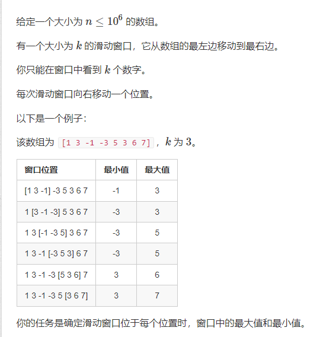

# 单调队列
[原题](https://www.acwing.com/problem/content/156/)
  


-  **暴力思路**  每次把k个区段插入到队列，$O(N)$遍历一遍队列
-  **优化** 考虑最小值的情况，假设现在要再队尾插入`a[i]`,而队尾的数字`x`大于`a[i]`那么在这个区段中，`x`会先于`a[i]`出队,最小值永远会是`a[i]`,故可以删去无用的`x`。所以我们要维护一个队列，使它是严格单调递增的,每次最小值永远在队头。
```cpp
#include<bits/stdc++.h>
using namespace std;
#define int long long
const int N = 1e6 + 10;
int a[N]={0};
//这里队列q存放的是数组a下标,方便每移动一次区段的时候判断队头是否超出了这个区段，从而弹出。
int q[N] = { 0 };
int tt = -1;
int hh = 0;
signed main() {
	int n;
	int k;
	cin >> n>>k;
	for (int i = 0; i < n; i++)cin >> a[i];
	for (int i = 0; i < n; i++) {
		if (hh <= tt && q[hh] < i - k + 1)hh++;	
		while (hh <= tt && a[q[tt]] >= a[i])tt--;
		q[++tt] = i;
		if (i >= k - 1)cout << a[q[hh]]<<' ';
	}
	cout << endl;
	hh = 0; tt = -1;
	for (int i = 0; i < n; i++) {
		if (hh <= tt && q[hh] < i - k + 1)hh++;
		while (hh <= tt && a[q[tt]] <= a[i])tt--;
		q[++tt] = i;
		if (i >= k - 1)cout << a[q[hh]] << ' ';
	}
	return 0;
}
```
