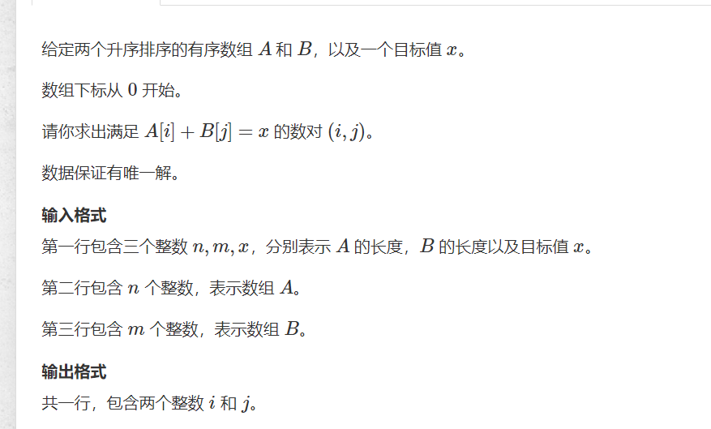

# 数组元素目标和

>(原题)[https://www.acwing.com/problem/content/802/]

  

```cpp
#include<bits/stdc++.h>
using namespace std;
#define int long long
const int N = 100010;
int a[N] = { 0 };
int b[N] = { 0 };
signed main() {
	int n, m;
	int x; 
	cin >> n>>m>>x;

	for (int i = 0; i < n; i++)cin >> a[i];
	for (int i = 0; i < m; i++)cin >> b[i];
	for (int l = 0, r = m - 1; l < n ; l++) {
		while (a[l] + b[r] > x)r--;
		if (a[l] + b[r] == x) {
			cout << l << ' ' << r;
			break;
		}
	}
	return 0;
}
```