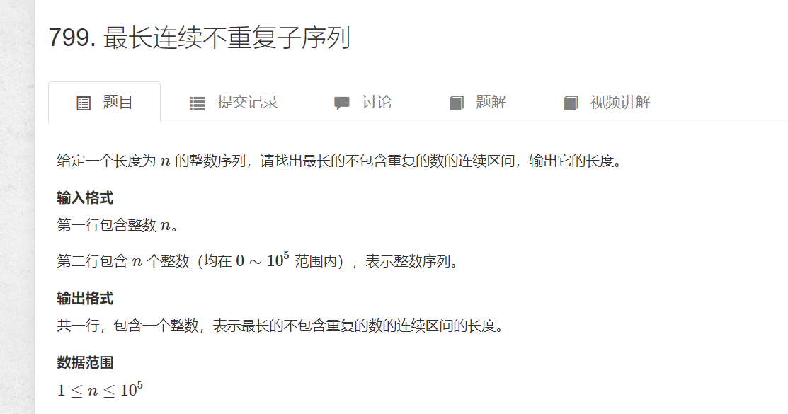

# 最大不重复连续子序列长度
>    (原题)[https://www.acwing.com/problem/content/801/]

  

```cpp
#include<bits/stdc++.h>
using namespace std;
#define int long long
const int N = 1e5 +10;
int a[N]={0};
int mymap[N] = { 0 };
signed main() {
	int n;
	cin >> n;
	int res = 0;
	for (int i = 0; i < n; i++)cin >> a[i];
	for (int i = 0,j=0; i < n; i++) {
		mymap[a[i]] ++;
		while (mymap[a[i]] > 1) {
            //j一直往右移动，同时删去左边的数，也就是--
            //减到无重复元素，即mymap[a[i]] ==1
			mymap[a[j]]--;
			j++;
			
		}
		res = max(res, i - j + 1);
	}
	cout << res;
	return 0;
}
```