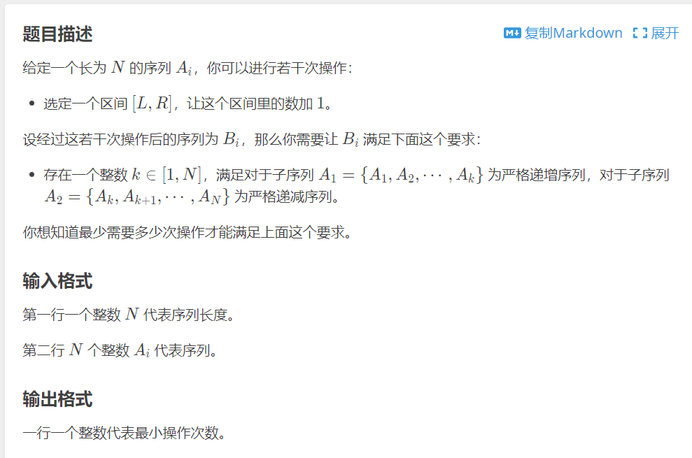

# 差分数组 :  

$\displaystyle\sum\limits_{i=1}^ndi = Ai$

---

**构造过程**:

每次输入一个**Ai**, **d[i]** 就需要加上 **Ai** ,但此时 **d[i]** 之后的数都会 $+$  **Ai**  , 那么就需要 **d[i+1]**  减去 **Ai** 

构造的时候相当于每次对区间长度为1的区间进行操作


```cpp
for (int i = 1; i <= n; i++) {
		int x;
		cin >> x;
		d[i] += x;
		d[i + 1] -= x;
	}
```

---

>[例题洛谷](https://www.luogu.com.cn/problem/P7404)

  

对区间进行操作，考虑用差分数组简化，将O(N)操作简化为O(1),即对差分数组==某两个数==操作就可以对一个区间操作
```cpp
#include<iostream>
#include <vector>
#include<map>
#include <cmath>
#include <algorithm>
#define int long long
using namespace std;
int d[2 * (int)1e5 + 10] = { 0 };
signed main() {
	int n;
	cin >> n;
    //构造差分数组
	for (int i = 1; i <= n; i++) {
		int x;
		cin >> x;
		d[i] += x;
		d[i + 1] -= x;
	}
	int l = 1, r = n;
	int ans = 0;
	while (l < r) {
        //在严格递增的部分，若出现d[i] <=0则不符合
        //严格递减部分同理
		while (d[l] > 0) l++; 
		while (d[r] < 0)r--;
		if (l > r) break;
        //取min是为了每次操作都不浪费，不会多加了
		int x = min(-d[l] + 1, d[r] + 1);
		d[l] += x;
		d[r] -= x;
		ans += x;

	}
	cout << ans;
}


```