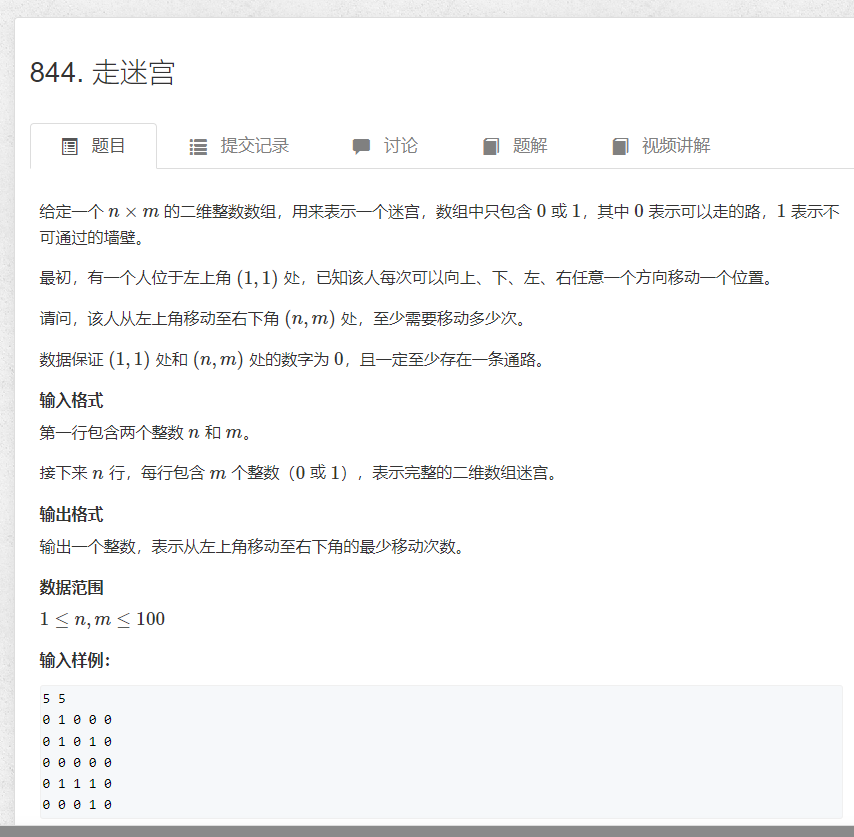

# 走迷宫
[原题](https://www.acwing.com/problem/content/846/)
  

#### 思路 : bfs是一圈一圈逐层向外拓展，每一圈遍历到的节点一定比上一圈的距离多1，那么如果我在一此搜索中走到之前已经搜索到的点，那么这种走法肯定不是最短路径,故我能保证穷举完成之后，一定能搜索到末节点，且其实路径最短
```cpp
#include <iostream>
#include <queue>
#include <cstring>
using namespace std;
const int N = 100;
typedef pair<int, int> PII;
//迷宫图
int map[N][N];
//每个点到起始节点的距离
int dis[N][N];
//储存上下左右四个点的走法的队列
queue<PII> cor;
int n, m;
//上下左右的偏移量
int dx[4] = { -1,0,1,0 }, dy[4] = {0,1,0,-1};
int bfs() {
	cor.push({ 0,0 });
	dis[0][0] = 0;
	while (cor.size()) {
		auto t = cor.front();
		cor.pop();
		for (int i = 0; i < 4; i++) {
			int x = t.first + dx[i];
			int y = t.second + dy[i];
            //x表示行，y表示列
			if (x >= 0 && x < n && y >= 0 && y < m && map[x][y] == 0 && dis[x][y] == -1) {
                //如果dis为-1，表示我还没有走到这个地点，那么此时为最短路径
				dis[x][y] = dis[t.first][t.second] + 1;
				cor.push({ x,y });
			}
		}
	}
	return dis[n - 1][m - 1];
}
signed main() {
	cin >> n>>m;
	for (int i = 0; i < n; i++)
		for (int j = 0; j < m; j++)cin >> map[i][j];
    //-1表示当前这个位置我还没有搜索过
	memset(dis, -1, sizeof(dis));
	cout << bfs();
	return 0;
}
```


粮食安全指的是能够稳定地让所有人取得足够食物的状态。联合国政府间气候变化专业委员会曾于2014年3月31日在日本横滨召开会议时发表了一份报告，报告中指出：“气候变迁正冲击粮食与人类安全。”世界银行总裁金墉也在4月表示，接下来5至10年间，气候变迁将引起食物和水的争夺战。在过去的战争中，拒绝运送粮食被用作一种武器，例如第一次世界大战的同盟国封锁运送途径而导致粮食严重短缺。同样，在两次世界大战中，德国为迫使英国就范，出动潜艇以封锁英国从外地输入粮食。国家元首努力控制他们的国家能维持足够的粮食供应，粮食安全是一个重要的政治问题，它可以推动国家政策、鼓励使用农业补贴的刺激耕作或导致冲突。1996年世界粮食安全首脑会议宣布“粮食不应该被用来作为一种武器”。