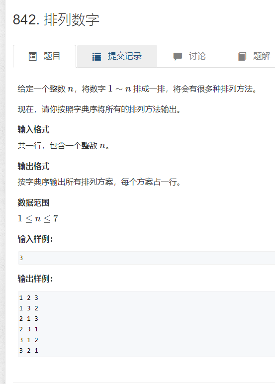

### dfs 全排列
[原题](https://www.acwing.com/problem/content/844/)
  

```cpp
#include <iostream>
using namespace std;
const int N = 10;
int n;
bool st[N];
int path[N];
void dfs(int digit) {
	if (digit == n) {
		for (int i = 0; i < n; i++)cout << path[i]<<' ';
		cout << '\n';
		return;
	}
	for (int i = 1; i <= n; i++) {
		if (!st[i]) {
			st[i] = 1;
			path[digit] = i;
			dfs(digit + 1);
            //回溯的时候要恢复
			st[i] = 0;
		}
	}
}
signed main() {
	cin >> n;
	dfs(0);
	return 0;
}
```