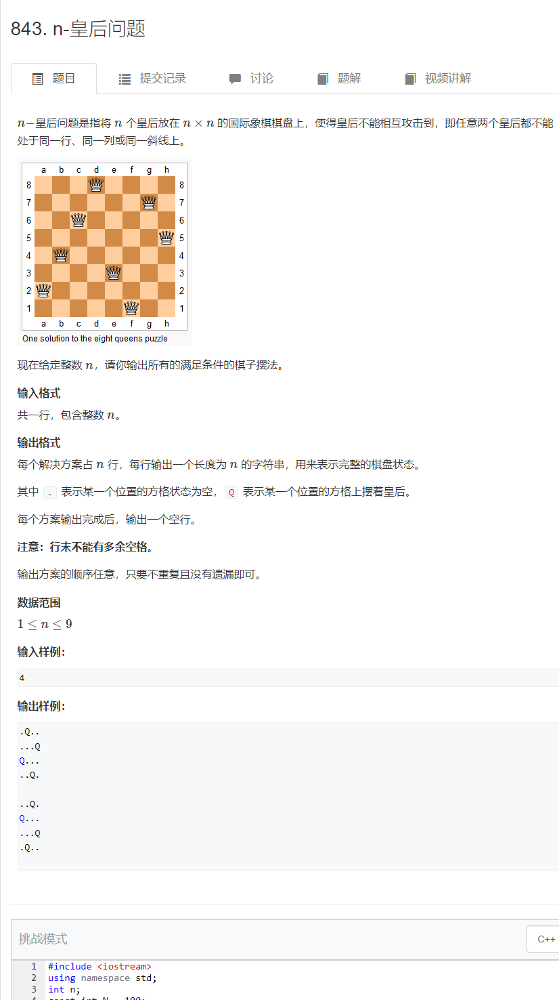

# n皇后问题
[原题](https://www.acwing.com/problem/content/845/)

  


```cpp
#include <iostream>
using namespace std;
int n;
const int N = 100;
//按行穷举，dg，udg，col分别表示主对角线，副对角线，列上是否已存在皇后
int dg[N], udg[N], col[N];
char ans[N][N];
void dfs(int D) {
	if (D == n) {
		for (int i = 0; i < n; i++) {
			puts(ans[i]);
		}
		puts("");
		return;
	}
	for (int i = 0; i < n; i++) {
		//对角线和列下标的关系用一次函数截距推算，副对角线+n是因为可能出现下标为负的情况，所以得加上一定的偏移量
		if (!col[i] && !dg[D + i] && !udg[D - i + n]) {
			ans[D][i] = 'Q';
			col[i] = dg[D + i] = udg[D - i + n] = 1;
			dfs(D + 1);
			//回溯的时候要记得恢复现场
			col[i] = dg[D + i] = udg[D - i + n] = false;
			ans[D][i] = '.';
		}
	}
	return;
}
signed main() {
	cin >> n;
	for (int i = 0; i < n; i++) {
		for (int j = 0; j < n; j++) {
			ans[i][j] = '.';
		}
	}
	dfs(0);
	return 0;
}
```