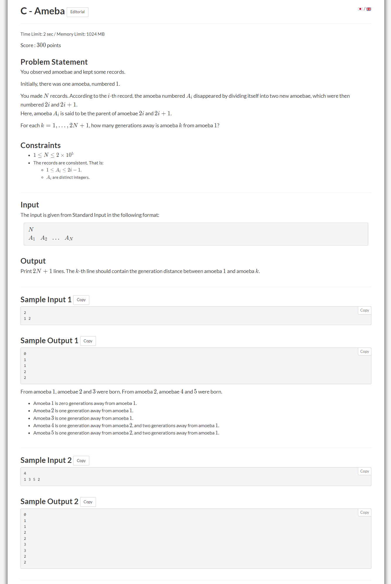

# 记忆化搜索

##  例题:atcoder
>  [原题](https://atcoder.jp/contests/abc274/tasks/abc274_c)

**核心思想**  在递归搜索的过程中，如果某个分支我们已经搜过了，那么就再开一个数组，记下这个分支的答案，下次搜索过程中再次遇到这个分支，就直接调用这个节点对应的数组返回答案。

  

**题意**：
给定数组Ai，每一个Ai会分裂成两个阿米巴原虫，分裂而成的子代记为2i 和 2i +1
求第i个阿米巴原虫和第1个阿米巴原虫隔了多少代


---

==思路==
开一个tree数组，他的下标表示i个阿米巴原虫，`tree[i]`表示他的亲代，然后看`dp[i]`,如果`dp[i]`存过，那么就直接返回`dp[i]`中储存的答案，否则`dp[i] = 下一层dp[tree[i]]的答案 +1`,不断的往下搜，往下搜的过程中如果下一层也没有储存过答案，重复`dp[i] = 下一层dp[tree[i]]的答案 +1`,直到搜到一个`dp[i]!=-1`再进行回溯。


```c++
#include<iostream>
#include <vector>
#include<map>
#include <cmath>
#include <algorithm>
#define int long long
using namespace std;
int tree[4 * (int)1e5 + 3];
int dp[4 * (int)1e5 + 3];

int GenCaculate(int i) {
	if (dp[i] != -1) 
		return dp[i];
	dp[i] = GenCaculate(tree[i]) + 1;
	return dp[i];//回溯
}
signed main() {
	int n;
	cout ;
	cin >> n;
	int temp;
	tree[1] = 1;
	memset(dp, -1, sizeof(dp));
	dp[1] = 0;
	for (int i = 1; i <= n; i++) {
		cin >> temp;
		tree[i * 2] = temp;
		tree[i * 2 + 1] = temp;
	}
	for (int i = 1; i <= 2 * n + 1; i++) {
		cout << GenCaculate(i)<<endl;
	}
	
}

```


