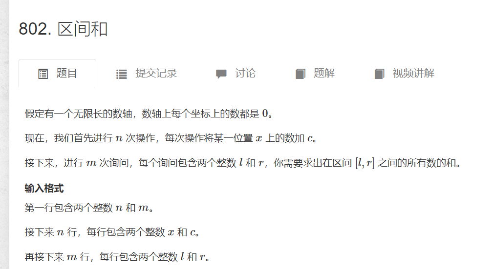

# 离散化求区间和
>(原题) [https://www.acwing.com/problem/content/804/]

  

```cpp
#include <bits/stdc++.h>
#define int long long
using namespace std;
const int N = 3 * 10e5 + 10;
int n, m;
//a数组为映射后做加法操作的数组
//s数组为前缀和数组
int a[N]={0}, s[N] = {0};
typedef pair<int, int> PII;
vector<int> alls;
vector<PII> add, query;
//映射函数
//使用二分查找alls中的元素，因为alls已经排好序了
//找到元素之后，将元素的值映射为他下标的数值
int find(int x) {
	int l = 0,r = alls.size() - 1,mid;
	while (l < r) {
		mid = l + r >> 1;
		if (alls[mid] >= x) r = mid;
		else l = mid + 1;
	}
	//映射到从1开始的自然数，所以要加一
	return r + 1;

}
signed main() {
	cin >> n >> m;
	for (int i = 0; i < n; i++) {
		int x, c;
		cin >> x >> c;
		add.push_back({ x,c });
		alls.push_back(x);
	}
	for (int i = 0; i < m; i++) {
		int l, r;
		cin >> l >> r;
		query.push_back({ l,r });
		alls.push_back(l);
		alls.push_back(r);
	}
	//去重
	sort(alls.begin(), alls.end());
	alls.erase(unique(alls.begin(), alls.end()), alls.end());
	for (auto &iter : add) {
		int pos = find(iter.first);
		a[pos] += iter.second;
	}
	for (int i = 1; i <= alls.size(); i++)s[i] = a[i] + s[i - 1];
	for (auto& iter : query) cout << s[find(iter.second)] - s[find(iter.first)-1]<<'\n';
	return 0;

}

```
