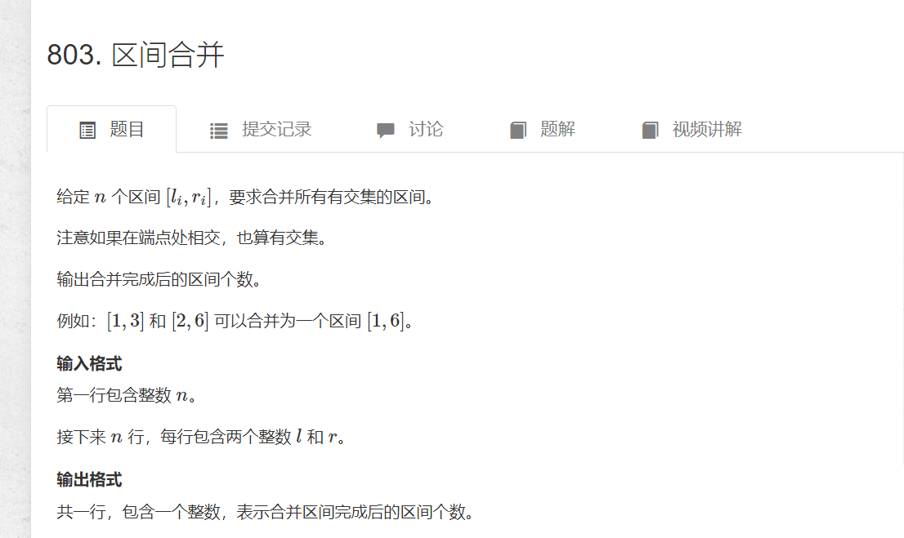

# 区间和并
>(原题)[https://www.acwing.com/problem/content/805/]
  

  ```cpp
  #include <bits/stdc++.h>
#define int long long
using namespace std;
const int N = 100010;
int n;
int a[N]={0}, s[N] = {0};
typedef pair<int, int> PII;
vector<PII> segs;
void merge(vector<PII>& segs) {
	vector <PII> res;
	sort(segs.begin(), segs.end());
	int st = -2e9, ed = -2e9;
	for (auto &iter : segs) {
		if (ed < iter.first) {
			if(st != -2e9)res.push_back({ st, ed });
			st = iter.first;
			ed = iter.second;
		}
		else {
			ed = max(ed, iter.second);
		}
	}
	//判非空 加上最后一段区间
	if (st != -2e9)res.push_back({ st, ed });
	segs = res;
}
signed main() {
	cin >> n;
	for (int i = 0; i < n; i++) {
		int l, r;
		cin >> l >> r;
		segs.push_back({ l,r });
	}
	merge(segs);
	cout << segs.size()<<'\n';
	return 0;

}
  ```