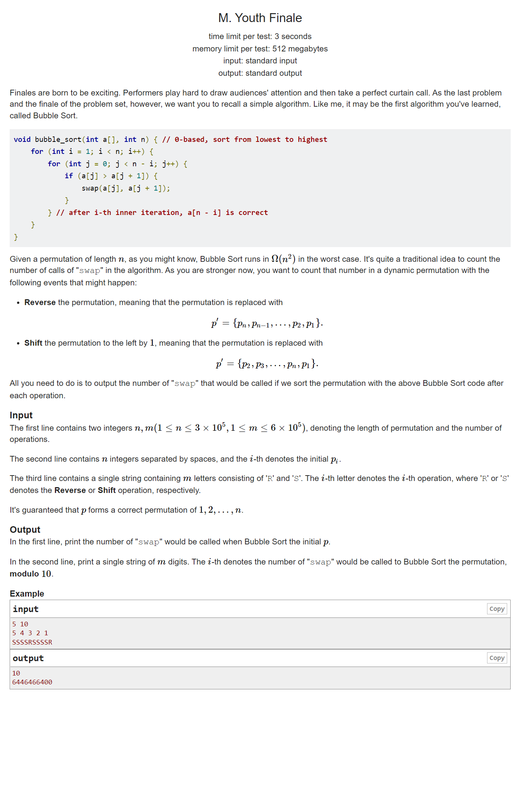

#  2022 ccpc M题(痛苦)
[原题](https://codeforces.com/gym/104008/problem/M)
  

>题意：给定一个数组，现在对数组进行两种操作
1.  shift:将首元素放至末尾
2.  reverse: 将整个数组反转顺序
求每次操作之后对数组**冒泡排序**后每次swap次数
---
**思路**
swap次数等于该数组逆序对数，先$O(nlogn)$求逆序对
1. 假设shift的数为i,那么shift之后逆序对减少$i-1$,增加$n-i$
2. reverse后逆序对变为正序对，那么求出数组所有数对total，total-原先逆序对数便是reverse后的逆序对数量
3. 假设每次shift的数下标为l，下次shift的数是$l+1$
4. 注意reverse之后，每次shift过后，下次shift的数是$l-1$
---
**注意下标 $l$ 是会循环的，所以要实现他不能越界，可以用模运算来操作，但是这道题下标自减会出现负数，所以模运算不是很好实现,故采用的if**

```cpp
#include <iostream>
#include <cstring>
using namespace std;
const int N = 6 * 1000100;
#define int long long
int a[N] = { 0 };
int temp[N] = { 0 };
int origin[N] = { 0 };
int ms(int* a, int l, int r) {
	if (l >= r) return 0;
	int mid = l + r >> 1;
	int res = ms(a, l, mid) + ms(a, mid + 1, r);
	int i = l, j = mid + 1, cnt = 0;
	while (i <= mid && j <= r) {
		if (a[i] <= a[j]) temp[cnt++] = a[i++];
		else temp[cnt++] = a[j++], res += mid - i + 1;
	}
	while (i <= mid)temp[cnt++] = a[i++];
	while (j <= r)temp[cnt++] = a[j++];
	for (int i = l, j = 0; i <= r; i++, j++)a[i] = temp[j];
	return res;
}
signed main() {
	ios::sync_with_stdio(0);
	cin.tie(0);
	cout.tie(0);
	int n, m;
	string s;
	cin >> n >> m;
	for (int i = 1; i <= n; i++) cin >> a[i], origin[i] = a[i];
	cin >> s;
	int x = ms(a, 1, n);
	cout << x << '\n';
	int total = (n * n - n) >> 1ll;
	int l = 1;
	int flag = 1;
	for (auto i = s.begin(); i != s.end(); i++) {
		if (*i == 'S') {
			if (flag == 1) {
				int pos = l++;
				x -= origin[pos] - 1;
				x += n - origin[pos];

				if (l > n) l = 1;
			}
			else if (flag == -1) {
				int pos = l--;
				x -= origin[pos] - 1;
				x += n - origin[pos];
				if (l < 1) l = n;
			}
		}
		else if (*i == 'R') {
			x = total - x;
            //若reverse,那么上次shift后l做过的改动就要撤销
			if (flag == 1) {
				l--;
				if (l < 1) l = n;
			}
			else if (flag == -1) {
				l++;
				if (l > n) l = 1;
			}
			flag *= -1;
		}
		cout << x % 10;
	}

	return 0;
}


```